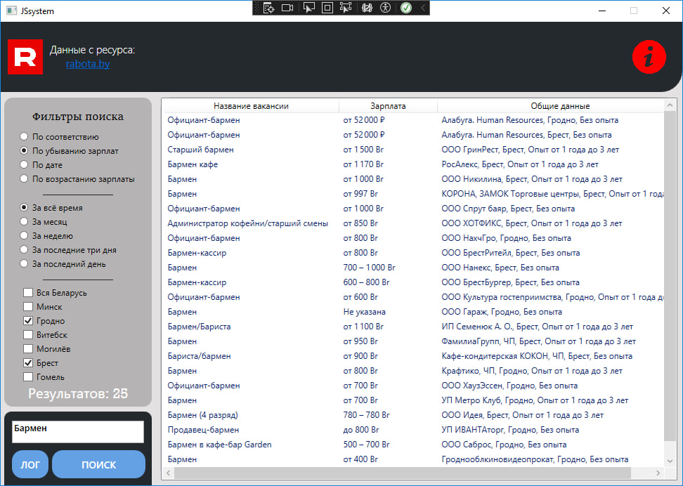

<h1 align="center">Hi there!</a> 
<h3 align="center">Thhe application that allows you to parse the necessary for Belarusians vacancies from the site rabota.by . Written with the aim of working on such interfaces, classes, technologies and libraries as:</h3><h3> 1)Async/await;  2)Selenium.Webdriver;  3)IEnumerable, IEnumerator;  4)Newtonsoft.Json; 5)System.IO. And so on...</h3>
  <h2>Keywords: WPF, C#, .NET, WINDOWS</h2>

